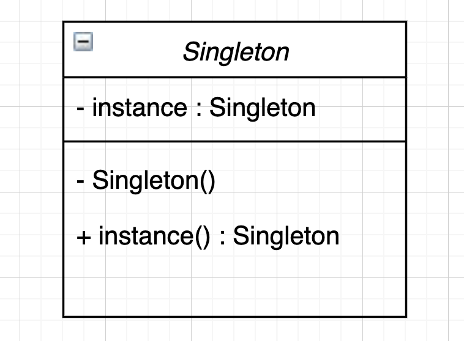
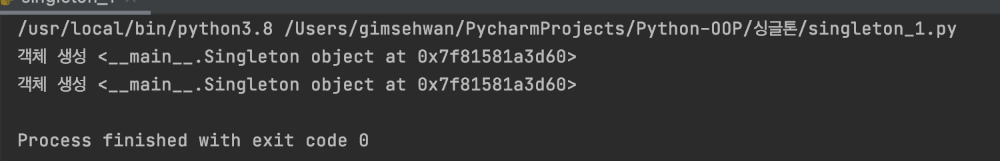
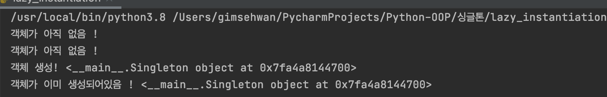

# 싱글톤

싱글톤 디자인 패턴은 글로벌하게 접근 가능한 하나의 객체를 제공하는 패턴이다.
로깅이나 데이터베이스 관련 작업, 프린터 스풀러와 같은 동일한  리소스에 대한 동시 요청의 충돌을 방지하기 위해 하나의 인스턴스를 공유하는 작업에 주로 사용한다.
예를 들어, 데이터 베이스의 일관성 유지를 위해 DB에 작업을 수행하는 하나의 데이터베이스 객체가 필요한 경우 또는
여러 서비스의 로그를 한개의 로그파일에 순차적으로 동일한 로깅객체에 사용해 남기는 경우에 사용한다 !

## 싱글톤 패턴의 목적?

1. 클래스에 대한 단일 객체 생성
2. 전역 객체 제공
3. 공유된 리소스에 대한 동시 접근 제어

## 싱글톤 패턴의 구조


생성자를 private으로 선언하고 객체를 초기화 하는 static 함수를 만들면 간단히 구현 가능하다.

첫 호출에 객체가 생성되고 클래스는 동일한 객체를 계속 반환한다 !

하지만....

파이썬에서는 private으로 생성자(`__init__`)를 선언 할수가 없다.

따라서 여러 구현방법이 제시되고, 우리는 적절한것을 찾아서 사용하면 된다!

## 싱글톤 패턴 구현 (자바)

파이썬으로 구현하는 싱글턴을 보기 전에, private으로 생성자를 선언 가능한 `Java`에서는 싱글톤 패턴을 어떻게 구현하는지 코드로 확인해보자!

```java
public class Singleton {
    private static Singleton singleton = new Singleton();
    // 정적 필드에 Singleton 생성자를 이용해서 singleton 객체를 한번 생성한다

    private Singleton() {};
    // 생성자는 외부 접근이 불가능하게 private 으로 접근제한한다

    static Singleton getInstance() {
        return singleton;
    }
    // 스태틱 메서드로 유일한 인스턴스를 리턴하는 스태틱 메서드를 작성한다.
    //static 리턴타입(싱글턴 객체의 타입이 리턴) getInstance 메서드 이름

    public static void main(String[] args) {
        Singleton a = Singleton.getInstance();
        Singleton b = Singleton.getInstance();

        if (a == b) {
            System.out.println("같은 인스턴스");
        }
        else {
            System.out.println("다른 인스턴스");
        }
    }
}
```

UML 다이어그램에 있는 그대로 구현하면 끝!

## 싱글톤 패턴 구현(파이썬)

```python3
class Singleton(object):
    """
    하나의 싱글톤 인스턴스를 생성
    이미 생성된 인스턴스가 있다면 재사용
    """
    def __new__(cls, *args, **kwargs):
        """
        *args와 **kwargs는 무슨의미일까?
        여러 가변인자를 받겠다고 명시하는 것이며, *args는 튜플형태로 전달, **kwargs는 키:값 쌍의 사전형으로 전달된다.
        def test(*args, **kwargs):
            print(args)
            print(kwargs)
        
        test(5,10,'hi', k='v')
        결과 : (5, 10, 'hi') {'k': 'v'}
        """
        if not hasattr(cls, 'instance'):
            cls.instance = super(Singleton, cls, *args, **kwargs).__new__(cls, *args, **kwargs)
        return cls.instance

if __name__ == '__main__':
    s = Singleton()
    print("객체 생성", s)
    s1 = Singleton()
    print("객체 생성", s1)
```
실제 실행 결과는 다음과 같다.



위 코드에서 `__new__` 매직메서드를 오버라이딩해 객체를 생서한다.
`__new__`메서드는 s객체가 이미 존재하는지 확인한 이후, `hasattr` 함수는 cls객체가 instance 속성을 갖고있는지 확인.
cls.instance 라는 어트리뷰트가 없는 경우에 한해서 생성자를 호출해 객체를 찍어낸다.
cls.instance 가 이미 있을경우, 기존 객체를 재사용한다 !

## 게으른 초기화 (Lazy instantiation)

게으른 초기화는 싱글톤 패턴을 기반으로 하는 초기화 방식이다.
모듈을 임포트 할 때, 아직 필요하지 않은 시점에 객체를 미리 생성하는 경우가 있다!
이 때 게으른 초기화를 사용하는 것인데.. 게으른 초기화는 인스턴스가 필요한 시점에 생성하는 방법이다!

코드를 통해 확인해보자

```python3
class Singleton(object):
    __instance = None

    def __init__(self):
        if not Singleton.__instance:
            print("객체가 아직 없음 !")
        else:
            print("객체가 이미 생성되어있음 !", self.get_instance())

    @classmethod
    def get_instance(cls):
        if not cls.__instance:
            cls.__instance = Singleton()
        return cls.__instance


if __name__ == "__main__":
    s = Singleton()  # 클래스를 초기화는 했지만.. 객체를 생성하진 않았다.
    print("객체 생성!", Singleton.get_instance())
    s1 = Singleton()

```

결과 !



## 실제 나의 적용 사례..

작년 여름 산업용 게이트웨이인 `Revolution Pi`용 모니터링 어플리케이션(웹)을 개발했을 때의 일이다.

잘 개발하고 나서 테스트를 해보면, 5~10분 뒤에 어플리케이션 서버가 뻗어버리는 이슈가 있었다. 

나의 미숙한 코드개발로 인해서 데이터를 수집하는 쪽 객체가 계속해서 생겨나고 있었고 메모리 누수로 인해 어플리케이션 서버가 뻗어버리는 현상이였다.

이 때 어디서 주워들은 싱글턴패턴이 기억나서 적용해보았는데, 매우 잘 해결되었던 기억이 있다!

그 코드를 확인해보자 !
```python3
import revpimodio2
import json
import os
from util import get_profile

TEST_JSON = {
    "sensor_list":{
        "InputValue_1" : "차압계",
        "InputValue_2" : "송풍기",
        "InputValue_3" : "배풍기",
        "RTDValue_1" : "온도"
    },
    "IMGPATH" : "/dev/piControl0",
    "data_information" : {
        "InputValue_1" : {
            "originalRange" : [4000, 20000],
            "changedRange" : [4, 20]
        },
        "InputValue_2" : {
            "originalRange" : [4000, 20000],
            "changedRange" : [4, 20]
        },
        "InputValue_3" : {
            "originalRange" : [4000, 20000],
            "changedRange" : [4, 20]
        },
        "RTDValue_1" : {
            "originalRange" : [0, 10000],
            "changedRange" : [0, 100]
        }
    }
} 

#for Test
PROFILE = None

def singleton(cls):
    instances = {}
    def getinstance():
        if cls not in instances:
            instances[cls] = cls()
        return instances[cls]
    return getinstance

@singleton
class RevolutionPi:

    def __init__(self):
        self.profile_path = "/home/pi/ksg_edge_deploy/socket_project/config.json" #revpi edge path
        self._profile = get_profile(self.profile_path)
        self.image_path = self._profile.get("IMGPATH")
        self.sensor_profile = self._profile.get("sensor_list")
        self.normalization_profile = self._profile.get("data_information")
        self.sampling_time = 0.02 #20ms
        self.before_buffer = []
        self.after_buffer = []
        self.rev = revpimodio2.RevPiModIO(autorefresh = True, procimg = self.image_path)
        self.rev.cycletime = 1000
        self.IO = self.rev.io
    
    def get_data(self):
        sensor_list = list(self.sensor_profile.keys())
        rev_data = [0]*len(sensor_list)  
        for idx in range(len(sensor_list)):
            rev_data[idx] = getattr(self.IO, sensor_list[idx]).value
        self.before_buffer = rev_data #list

    def data_normalization(self):
        self.get_data()
        self.after_buffer = []
        profile = self.normalization_profile

        for i,v in enumerate(profile):
            input_start = profile.get(v).get('originalRange')[0]
            input_end = profile.get(v).get('originalRange')[1]
            change_start = profile.get(v).get('changedRange')[0]
            change_end = profile.get(v).get('changedRange')[1]
            n = (change_end - change_start) / (input_end - input_start)
            processed_data = self.before_buffer[i] * n + change_start - input_start * n
            self.after_buffer.append(float(round(processed_data,2)))

```

찾아보니까 특정 클래스에 싱글톤을 적용시키는 방법이 매우 여러가지가 있었다.
이 때 제일 매력적으로 나에게 느껴진것은 `데코레이터`를 이용한 싱글톤 적용인데, 위 코드에서 이 부분이다.

```python3
def singleton(cls):
    instances = {}
    def getinstance():
        if cls not in instances:
            instances[cls] = cls()
        return instances[cls]
    return getinstance

@singleton
class RevolutionPi:
    pass
```

## 모듈 싱글톤

파이썬의 임포트 방식으로 인해 모든 모듈은 기본적으로 싱글톤이다. 임포트 방식은 다음과 같다.

1. 파이썬 모듈이 임포트 되었는지 확인한다.
2. 이미 임포트 된 경우, 해당 모듈의 객체를 반환한다. 임포트 되지 않은 경우 임포트 후 초기화 한다.
3. 모듈은 임포트와 동시에 초기화된다. 모듈을 다시 임포트하면 초기화 되지 않는다. 하나의 객체를 유지 및 반환하는 싱글톤 패턴이다.

## 모노스테이트 싱글톤 패턴

GoF의 싱글톤 디자인 패턴에는 클래스 객체가 하나만 존재한다. 하지만 알렉스 마르텔리는 상태를 공유하는 인스턴스가 필요하다고 주장한다!
객체 생성 여부보다는 객체의 상태와 행위가 더 중요하다고 이야기 하는 것.

모노스테이트 싱글톤 패턴은 이름 그대로 모든 객체가 같은 상태를 공유하는 패턴이다.

파이썬으로 간단하게 모노스테이트 패턴을 구현해보자. 

```python3
class Foo:
    __shared_sate = {"1": "2"}

    def __init__(self):
        self.x = 1
        self.__dict__ = self.__shared_sate
        pass


if __name__ == '__main__':
    f = Foo()
    f1 = Foo()
    f.x = 4

    print("Foo object f : ", f)
    print("Foo object f1 : ", f1)
    # f와 f1은 다른 객체이다.
    print("f's attribute x :", f.x)
    print("f1's attribute x :", f1.x)
    # 하지만 상태를 공유한다!

"""
output
Foo object f :  <__main__.Foo object at 0x7fbba00769a0>
Foo object f1 :  <__main__.Foo object at 0x7fbba0144700>
f's attribute x : 4
f1's attribute x : 4
"""
```

Foo 클래스의 인스턴스인 f와 f1은 서로 다른 객체이다.
하지만 `f.__dict__` 과 `f1.__dict__`는 동일하다. 따라서 어느 인스턴스에서 속성을 변경하면, 모든 인스턴스에 반영된다!

다음은 `__new__` 메서드를 사용해서 모노스테이트 싱글턴을 구현하는 방법이다.

```python3
class Foo:
    _shared_state = {}

    def __new__(cls, *args, **kwargs):
        obj = super(Foo, cls).__new__(cls, *args, **kwargs)
        obj.__dict__ = cls._shared_state
        return obj


if __name__ == '__main__':
    f = Foo()
    f1 = Foo()

    f.x = 4

    print("Foo object f : ", f)
    print("Foo object f1 : ", f1)
    # f와 f1은 다른 객체이다.
    print("f's attribute x :", f.x)
    print("f1's attribute x :", f1.x)
    # 하지만 상태를 공유한다!

"""
output
Foo object f :  <__main__.Foo object at 0x7fd8e00c4640>
Foo object f1 :  <__main__.Foo object at 0x7fd8e00c4760>
f's attribute x : 4
f1's attribute x : 4
"""
```

## 싱글톤과 메타클래스

메타클래스는 클래스의 클래스이다. 즉 클래스는 자신의 메타클래스의 인스턴스다.
메타클래스를 사용하면 이미 정의된 파이썬 클래스를 통해 새로운 형식의 클래스를 생성 할 수 있다.

예를  들어 `MyClass`라는 객체가 있다면 `MyKls`라는 메타 클래스를 생성해 `MyClass`의 행위를 재정의 할 수 있다.

파이썬에서 모든것은 객체다. a=5라면, type(a)는 <type 'int'>를 반환한다. a는 int형 변수라는 뜻.
하지만 type(int)는 <type 'type'>을 반환한다. int의 메타클래스는 type 클래스라는 의미이다 !!

클래스는 메타클래스가 정의한다. 클래스 A의 객체를 초기화하면 파이썬은  내부적으로 A = type(name, base, dict)을 수행한다.

- name : 클래스명
- base : 기본 클래스
- dict : 클래스 속성

다음은 메타클래스를 구현해본 코드이다.

```python3
class MyInt(type):
    """
    커스텀 Int 클래스. __call__ 매직메서드는 객체가 초기화 될때 수행할 메서드임.
    """

    def __call__(cls, *args, **kwargs):
        print("-- 내가 정의한 int 클래스 -- ", args)
        return type.__call__(cls, *args, **kwargs)


class int(metaclass=MyInt):
    def __init__(self, x, y):
        self.x = x
        self.y = y


if __name__ == "__main__":
    i = int(4, 5)

"""
output
-- 내가 정의한 int 클래스 --  (4, 5)
"""
```

여기서 알 수 있는 점은. 객체 생성을 메타클래스가 제어한다는 것이다.

이 개념은 싱글턴 패턴에 적용이 가능하다. 메타클래스는 클래스 생성과 객체 초기화를 더 세부적으로 제어할 수 있기 때문에, 싱글톤 생성에도 이용 가능하다.

다음은 메타클래스를 사용해 싱글톤 패턴을 구현한 코드이다.

```python3
class MetaSingleton(type):
    _instance = {}

    def __call__(cls, *args, **kwargs):
        if cls not in cls._instance:
            cls._instance[cls] = super(MetaSingleton, cls).__call__(*args, **kwargs)
        return cls._instance[cls]


class Logger(metaclass=MetaSingleton):
    pass


if __name__ == "__main__":
    logger1 = Logger()
    logger2 = Logger()
    print(logger1, logger2)
    
"""
output
<__main__.Logger object at 0x7fd5b806bd60> <__main__.Logger object at 0x7fd5b806bd60>
"""

```

어떤 클래스에 싱글톤을 적용하는 방법에는 내가 위에서 사용했었던 데코레이터를 활용해 특정 클래스에 싱글톤을 적용하는 방법과, 이렇게 메타클래스를 활용해 싱글톤을 적용하는 방법. 크게 두가지가 있는 것 같다.

## 싱글톤 패턴 사용 사용 사례

DB 커넥션 객체에 싱글톤을 적용하기.

이 사례에서는 단일 웹 어플리케이션이 DB에 접근한다는 컨셉에서 출발한다. 만약 `여러` 웹 어플리케이션이 단일 DB에 접근한다고 하면.
각 웹 어플리케이션에의 DB커넥션을 각각 싱글톤을 적용하기보다는, 연결 풀링 기법이 더 유리함을 유의하면서 사용할것.

Micro Service에서의 DB커넥션 객체는 이 패턴이 유용하진 않을 것 같다. (혹시 아시는 분이 계시다면 피드백 부탁드립니다)

```python3
import sqlite3


class MetaSingleton(type):
    _instances = {}

    def __call__(cls, *args, **kwargs):
        if cls not in cls._instances:
            cls._instances[cls] = super(MetaSingleton, cls).__call__(*args, **kwargs)
        return cls._instances[cls]


class Database(metaclass=MetaSingleton):
    connection = None

    def connect(self):
        if self.connection is None:
            self.connection = sqlite3.connect('db.sqlite3')
            self.cursorobj = self.connection.cursor()
        return self.cursorobj


if __name__ == '__main__':
    db1 = Database().connect()
    db2 = Database().connect()

    print('Database 객체 db1 ', db1)
    print('Database 객체 db2 ', db2)

    """
    output
    Database 객체 db1  <sqlite3.Cursor object at 0x7fb2b05d2b20>
    Database 객체 db2  <sqlite3.Cursor object at 0x7fb2b05d2b20>
    """
```

## 싱글톤 패턴의 단점

싱글톤 패턴은 효율적이지만 단점도 있다. 싱글톤의 단일 전역 객체는 다음과 같은 문제점이 있을 수 있다.

1. 전역 변수의 값이 실수로 변경된 것을 ㅗ르고 애플리케이션의 다른 부분에서 사용 될 수 있다.
2. 같은 객체에 대한 여러 참조자가 생길 수 있다. 싱글톤은 하나의 객체만을 생성하기 떄문에 같은 객체를 참조하는 여러 개의 참조자가 생긴다.
3. 전역 변수를 수정하면 종속된 모든 클래스에 의도하지 않은 영향(사이드 이펙트)을 줄 수 있다.

> 싱글톤 패턴 정리
> 애플리케이션을 개발 할 때 스레드 풀과 캐시, 대화 상자, 레지스트리 설정 등 한개의 객체만 필요한 경우 적합하다.
> 싱글톤은 글로벌 액세스 지점을 제공하는, 단점이 거의 없는 검증된 패턴이다.
> 단점은 전역변수 사용이 문제가 될 수 있으며, 결국 사용하지 않을 클래스를 불필요하게 초기화 할 수 있다는 것.

