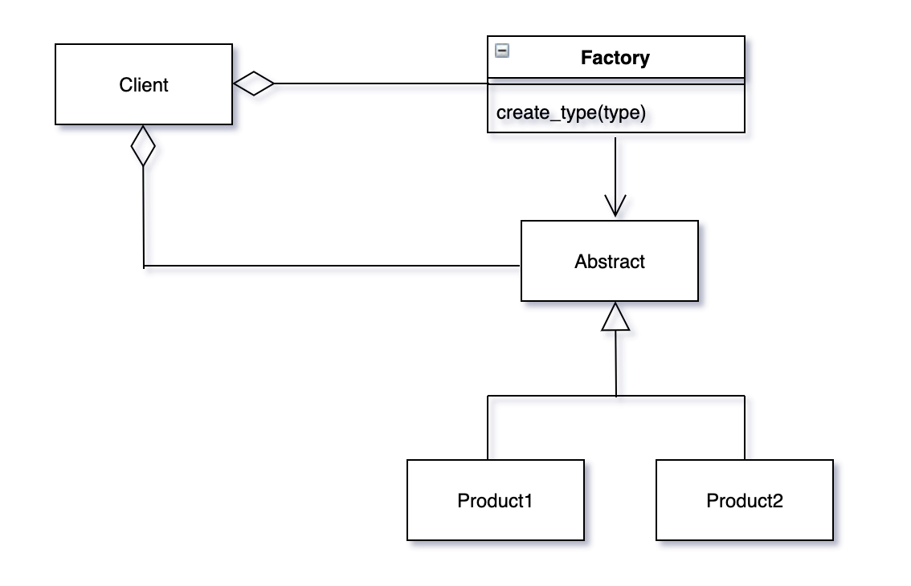
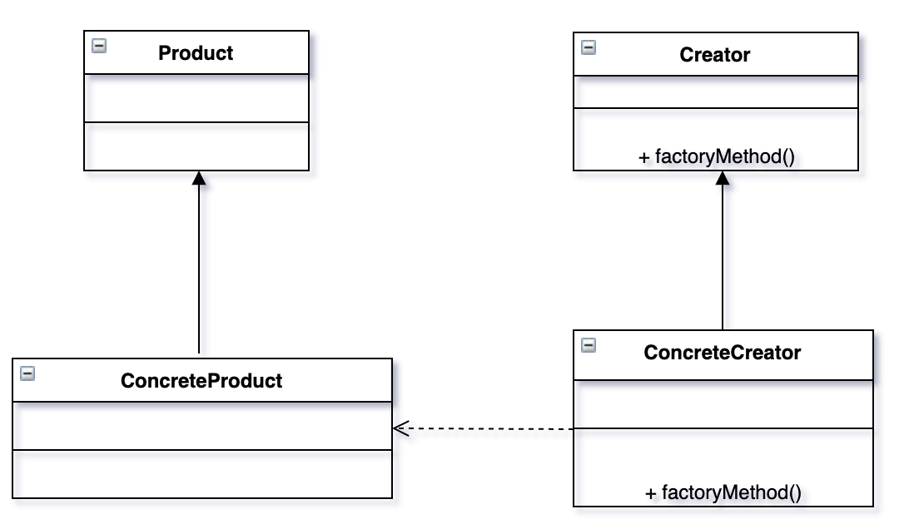

# 팩토리 패턴

팩토리 패턴은 가장 많이 쓰이는 디자인 패턴이다. 
- 팩토리 메소드 패턴
- 추상 팩토리 패턴

위 두가지 패턴을 UML 다이어그램으로 표현하고, 파이썬으로 작성해본다!

## 팩토리 패턴 개요

객체지향 프로그래밍에서 팩토리(Factory)란 다른 클래스의 객체를 생성하는 클래스를 일컫는다.
일반적으로 팩토리는 객체와 관련 메소드로 구성되어있다.
클라이언트는 특정 인자와 함께 메소드를 호출하고, 팩토리는 해당 객체를 생성하고 반환한다.

클라이언트가 직접 객체를 생성 할 수 있는데 팩토리가 필요한 이유는 다음과 같다.

- 객체 생성과 클래스 구현을 나눠 상호 의존도를 낮춘다.
- 클라이언트는 생성하려는 객체 클래스 구현과 상관없이 사용할 수 있다. 객체를 생성 할 때
필요한 인터페이스와 메소드, 인자등의 정보만 있으면 된다. 따라서 클라이언트의 일이 줄어든다.
- 코드를 수정하지 않고 간단하게 팩토리에 새로운 클래스를 추가 할 수  있다. 인자 추가가 전부인 경우도 있다.
- 이미 생성된 객체를 팩토리가 재활용 할 수 있다. 클라이언트가 직접 객체를 생성하는 경우 매번 새로운 객체가 생성된다.

자동차나 인형 같은 완구를 제조하는 공장을 예로 들어보자!
이 업체는 자동차 장난감만 제조해왔지만, 인형에 대한 시장의 수요가 늘어나는 상황을 고려해, 급히 인형도 제조하기로 했다.
팩토리 패턴이 적합환 상황이다. 이경우 공장의 제조 기계는 인터페이스이고, CEO는 클라이언트이다.
CEO는 제조하려는 객체와 제품을 만드는 인터페이스에 대해서만 알고있다.

팩토리 패턴에는 다음 세 가지 유형이 있다.

- 심플 팩토리 패턴 : 인터페이스는 객체 생성 로직 숨기고 객체를 생성한다.
- 팩토리 메소드 패턴 : 인터페이스를 통해 객체를 생성하지만 서브 클래스가 객체 생성에 필요한 클래스를 선택한다.
- 추상 패토리 패턴 : 추상 팩토리는 객체 생성에 필요한 클래스를 노출하지 않고 객체를 생성하는 인터페이스이다. 내부적으로 다른 팩토리 객체를 생성한다.을

## 심플 팩토리 패턴

심플 팩토리 패턴은 하나의 패턴으로 인정하지 않기도 한다. 그래서 기본 개념으로 알아두면 된다.
팩토리 메소드 패턴을 이해하기 위한 기본 개념 정도로 생각하면 된다. 팩토리를 사용하면 여러 종류의 객체를 사용자가 직접 클래스를 호출하지 않고 생성할  수 있다.

다음 그림은 위에서 말한 개념을 설명한다. 클라이언트 클래스는 `create_type()`메소드가 있는 팩토리 클래스를 사용한다.
클라이언트가 타입을 명시해 `create_type()`메소드를 호출하면 팩토리는 Product1 또는 Product2를 반환한다.




```python3
from abc import ABCMeta, abstractmethod


class Animal(metaclass=ABCMeta):
    @abstractmethod
    def do_say(self):
        pass


class Dog(Animal):
    def do_say(self):
        print('멍 멍!!')


class Cat(Animal):
    def do_say(self):
        print("야옹")


## forest factory 정의

class ForestFactory(object):
    def make_sound(self, object_type):
        return eval(object_type)().do_say()


if __name__ == '__main__':
    ff = ForestFactory()
    animal = input('Which animal should make_sound Dog or Cat?')
    ff.make_sound(animal)
```

## 팩토리 메소드 패턴

다음은 팩토리 메소드 패턴의 개념을 이해하는 데 필요한 내용이다.

- 인터페이스를 통해 객체를 생성하지만 팩토리가 아닌 서브 클래스가 해당 객체 생성을 위해 어떤 클래스를 호출할지 결정한다.
- 팩토리 메소드는 인스턴스화가 아닌 상속을 통해 객체를 생성한다.
- 팩토리 메소드 디자인은 유동적이다. 심플 팩토리 메소드와는 다르게 특정 객체 대신 인스턴스나 서브 클래스 객체를 반환할 수 있다.



위 UML 다이어그램을 보면, `factoryMethod()` 메소드를 포함하는 `Creator` 추상 클래스가 있다.
`factoryMethod()` 메소드는 객체 생성을 담당한다. `ConcreateCreator` 클래스의 `factoryMethod()`는
Creator 추상 클래스의 메소드를 구현하고 생성된 객체를 런타임에 반환한다. `ConcreteCreator`는 `ConcreteProduct`를 생성하고
생성된 객체가 `Product` 클래스를 상속받아 `Product` 인터페이스의 모든 함수를 포함시킨다.

Creator 인터페이스의 factoryMethod()와 ConcreteCreator 클래스는 Product 클래스의 어떤 서브클래스를
생성할지 결정한다. 즉 팩토리 메소드 패턴은 객체를 생성하는 인터페이스를 정의하고, 어떤 클래스를 초기화 할지는 서브클래스의 결정에 맡기는 것.
