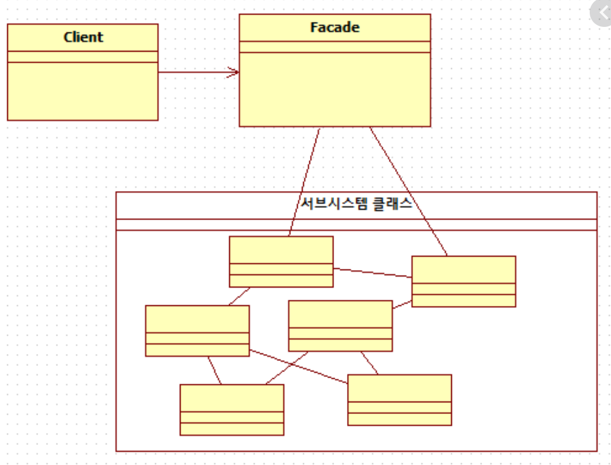

# 퍼사드 패턴

우선 구조 디자인 패턴이 무엇인지에 대해 알아보고 시작하자. (퍼사드 패턴은 구조 패턴 중 하)

## 구조 디자인 패턴 개요 


- 구조 디자인 패턴은 객체와 클래스를 병합해 더 큰 구조를 만든다.
- 개체의 관계를 더 쉽게 식별할 수 있는 디자인 패턴이다.
- 개체란 객체지향 개념에서의 객체나 클래스를 가리킨다.
- 클래스 패턴은 상속을 통해 추상화해 인터페이스를 제공하는 반면에
객체 패턴은 한개의 객체를 더 큰 객체로 확장시킨다. 구조 패턴은 클래스 패턴과 객체 패턴을 합친 패턴이다.

다음은 구조 디자인 패턴의 몇가지 예다. 설계상 목적 또는 복잡도에 따라 객체 또는 클래스 간 상호작용이 생긴다.

- 어댑터 패턴 : 클라이언트의 요구에 따라 특정 인터페이스를 다른 인터페이스에 맞춘다. 서로 다른 클래스의 인터페이스를 목적에 맞춰 변환한다.
- 브릿지 패턴 : 객체의 인터페이스와 구현을 분리해 독립적으로 동작할 수 있게 한다.
- 데코레이터 패턴 : 런타임에 객체의 책임을 덧붙인다. 인터페이스를 통해 객체에 속성을 추가한다.

## 퍼사드 디자인 패턴 개요

퍼사드란 건물의 정면, 특히 돋보이는 쪽을 의미하는 말이다.

우리가 건물을 볼 때 멋진 외관에 신경쓰지 복잡한 내부 구조는 생각하지 않는다.
이게 퍼사드 패턴의 핵심이다. 복잡한 시스템 내부 로직을 감추고 클라이언트가 쉽게 시스템에 접근 할 수 있는 인터페이스를 제공한다.

퍼사드 디자인 패턴의 목적은 다음과 같다.

- 서브시스템의 인터페이스를 통합시킨 단일 인터페이스를 제공해 클라이언트가 쉽게 서브시스템에 접근 할 수 있게 한다.
- 단일 인터페이스 객체로 복잡한 서브시스템을 대체한다. 서브시스템을 캡슐화하는 것이 아니라 모든 서브시스템을 결합한다.
- 클라이언트와 내부 구현을 분리한다.

쉽게 생각해서 여러 함수들을 감싸주는 `wrapper` 함수마냥 복잡하거나 드러운 API들을 하나의 좋게 작성된 API로 감싸주는 역할을 할 수 있고.
라이브러리 바깥쪽의 코드가 라이브러리 안쪽 코드에 의존하는 일을 감소시켜준다.

## UML 클래스 다이어그램



위 다이어그램을 보면 총 3개의 구성원이 있다.

- 퍼사드 : 외부에서 보기 깔끔하도록 복잡한 서브시스템을 감싸는 역할
- 시스템 : 전체 시스템을 하나의 복잡한 복합체로 만드는 서브시스템의 집합
- 클라이언트 : 퍼사드를 통해 서브시스템과 통신한다. 복잡한 시스템 구조에 대해 전혀 알필요가 없다.

## 퍼사드
퍼사드의 역할은 다음과 같다.

- 어떤 서브시스템이 요청에 알맞는지 알고 있는 인터페이스다.
- 컴포지션을 통해 클라이언트의 요청을 적합한 서브시스템 객체에 전달한다.

클라이언트가 특정 작업을 수행할 때 모든 관련 서브시스템에 요청하지않고 메인 인터페이스만 요청을 보내면 된다.

## 시스템
퍼사드 관점에서 시스템은 다음과 같은 역할을 하는 개체이다.
- 서브시스템의 기능을 구현하는 클래스다. 이상적으로 시스템은 각기 다른 역할을 하는 클래스의 집합이다.
- 퍼사드 객체가 지시한 일을 담당하지만 퍼사드의 존재도 모르며 참조하지 않는다.

정리하자면... 각 서브시스템들이나 전체 시스템은 퍼사드의 존재를 모르게끔 코딩한다.
퍼사드를 참조하지 말라는 것은 퍼사드에 종속되어있는 코드가 있으면 안된다는 것

클라이언트가 퍼사드에 특정 서비스를 요청하면 퍼사드는 알맞은 서브시스템을 선택하고 반환한다.

## 클라이언트
클라이언트는 다음과 같이 정의한다.
- 클라이언트는 퍼사드를 인스턴스화 하는 클래스다.
- 퍼사드에 서브시스템을 통해 작업을 수행하도록 요청한다.

클라이언트가 직접 서브시스템들을 조합해서 사용 할 수도 있겠지만..

그게 어렵고 불편하니 퍼사드라는 래퍼같은 느낌을 사용하는거라고 생각하자.

보통은 xxxManager 와 같은 클래스를 만들어놓고. 실제 수행될 프로세스가 있는 코드(파이썬)에서

xxx_manager 혹은 xxxm 과 같이 작명해서 인스턴스화 해서 사용하는게 보편적임

## 퍼사드 패턴 구현

여러분이 가까운 친척의 결혼준비를 도와준다고 생각해보자.
예식장, 음식, 꽃, 장식, 축가 등 준비해야할게 너무 많다.

옛날같아서는 이런걸 일일이 연락해서 직접 준비했겠지만 요즘 시대는 웨딩플래너와 같은 대리인들이 있다.
이들이 우리가 직접 일일이 해야했던 일을 대신해줄것이다.

여기서 웨딩 플래너는 퍼사드
서브시스템은 예식장, 음식, 꽃 등과 같은 것들
클라이언트는 여러분이다.


### 각 서브시스템 예시 코드 (subsystems.py)

```python3
class Hotelier:
    def __init__(self):
        print('Hotelier instantiate')

    def _is_availale(self) -> bool:
        print("호텔이 예약 가능한지 알아보겠습니다.")
        # 예제니까 무조건 참을 반환하자
        return True

    def book_hotel(self):
        if self._is_availale():
            print("호텔을 예약했습니다.\n\n")


class Florist:
    def __init__(self):
        print('Florist instantiate')

    def set_flower_requirements(self):
        print('꽃 장식을 다 완료했습니다. \n\n')


class Caterer:
    def __init__(self):
        print('Caterer instantiate')

    def set_cuisine(self):
        print('음식 준비를 완료했습니다. \n\n')


class Musician:
    def __init__(self):
        print('Musician instantiate')

    def set_music_type(self):
        print('재즈와 클래식 연주를 준비하겠습니다.')


```

### 서브시스템을 핸들하는 EventManager 클래스를 구현한 코드 (event_manager.py)

```python3
from subsystems import (
    Hotelier,
    Florist,
    Musician,
    Caterer
)


class EventManager:

    def __init__(self):
        self.musician = Musician()
        self.caterer = Caterer()
        self.florist = Florist()
        self.hotelier = Hotelier()
        print('Event manager called (instance)')

    def arrange(self):
        self.hotelier.book_hotel()

        self.florist.set_flower_requirements()

        self.caterer.set_cuisine()

        self.musician.set_music_type()

```

### 마지막으로 실제 프로세스(여기서는 여러분을 뜻하는 You 클래스의 객체가 수행)가 돌아갈 코드 (main.py)

```python3
from event_manager import EventManager


class You:
    def __init__(self):
        print('행사 준비를 시작합니다')
    
    def ask_event_manager(self):
        print('이벤트 매니저에게 위임합니다.')

        em = EventManager()
        em.arrange()

    def __del__(self):
        print('You 클래스의 인스턴스가 사라집니다. 이벤트 매니저 역시 같이 사라집니다.')


if __name__ == '__main__':
    you = You()
    you.ask_event_manager()

```

### 수행 결과

```console
행사 준비를 시작합니다
이벤트 매니저에게 위임합니다.
Musician instantiate
Caterer instantiate
Florist instantiate
Hotelier instantiate
Event manager called (instance)
호텔이 예약 가능한지 알아보겠습니다.
호텔을 예약했습니다.


꽃 장식을 다 완료했습니다. 


음식 준비를 완료했습니다. 


재즈와 클래식 연주를 준비하겠습니다.
You 클래스의 인스턴스가 사라집니다. 이벤트 매니저 역시 같이 사라집니다.
```

생각보다 이 패턴 많이 쓰이니까 잘 기억하자!!

- EventManager You 클래스를 위해 인터페이스를 간소화해주는 퍼사드이다.
- EventManager 컴포지션을 통해 서브시스템들의 객체를 생성한다.

## 최소 지식 원칙

퍼사드는 서브시스템을 쉽게 사용할 수 있는 통합 시스템늘 제공한다. 동시에 클라이언트와 서브시스템을 분리하는 역할도 한다.
퍼사드 패턴은 최소 지식 원칙을 기반으로 한다.

최소 지식 원칙은 상호작용하는 객체를 밀접한 몇개의 객체로 최소화 한다.

- 시스템을 설계할 때 생성하는 모든 객체가 몇 개의 클래스와 연관되며 어떤식으로 대화하는지 알아야 한다.
- 원칙에 따라 지나치게 서로 얽혀있는 클래스를 만드는 것을 지양해야 한다.
- 클래스 간의 의존도가 높아질수록 시스템 유지보수가 힘들어진다.
시스템의 한 부분을 수정하면 다른 부분이 의도치 않게 변경될 수 있다. 이런 회귀적인 구조는 반드시 피하자!
  

### 의문점

퍼사드 자체의 기능은 없을까? 그저 래핑하는 친구일까?

- 서브 시스템의 특수한 순서를 결정하거나, 서브시스템에 대한 퍼사드가 자신만의 로직을 포함하는 경우도 있다.

(대부분의 경우는 서브시스템의 호출 순서를 정리하는 로직이 들어가겠지.. 예외처리도 충분히 가능하고 !)

## 정리

퍼사드는 서브시스템을 캡슐화하지 않는다. 클라이언트는 퍼사드를 통하지 않고도 자유롭게 서브시스템에 접근 할 수 있다.
