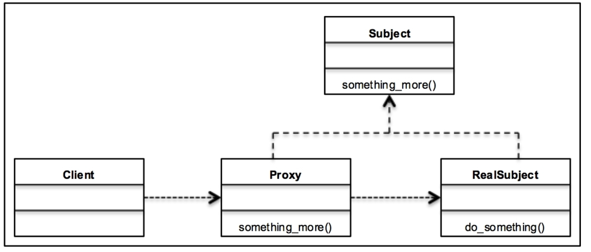

# 프록시 패턴 - 객체 접근 제어

일반적으로 프록시란 요청자와 공급자 사이의 중재자를 일컫는다.
요청자는 요청을 하고 공급자는 요청에 맞는 리소스를 전달한다.

웹 관점에서는 프록시 서버가 이에 해당한다!

클라이언트가 특정 웹사이트에 접속하면 우선 프록시 서버에 웹 페이지 등의 리소스를 요청한다.
프록시 서버는 내부적으로 요청을 분석해 알맞는 서버로 보내고 결과를 받아 클라이언트에 전달한다!

프록시 서버는 요청을 캡슐화 하기 때문에 분산 시스템 구조에 적합하다!

디자인 패턴에서의 프록시 클래스는 객체의 인터페이스 역할을 한다.
객체는 네트워크 연결, 메모리, 파일에 저장된 객체 등 다양한 종류에 해당된다!

프록시 클래스는 반환해 사용할 객체를 감싸는 포장지(wrapper) 또는 에이전트 객체다.

프록시는 객체 클래스의 구현과 상관없이 감싸려는 객체에 대한 기능을 제공한다.

프록시 패턴의 주 목적은 실제 객체에 접근 할 수 있는 대리 객체나 껍데기를 제공하는 것이다!

## 프록시 패턴의 역할
- 복잡한 시스템을 간단하게 표현할 수 있다.
- 객체에 대한 보안을 제공한다. 일반적으로 클라이언트는 객체에 직접 접근 할 수 없다. 객체가 악의적인 활동에 의해 변형될 수 있기 때문!
- 다른 서버에 존재하는 외부 객체에 대한 로컬 인터페이스를 제공한다. 예를들어 분산 시스템 구조에서 클라이언트가 원격으로 특정 커맨드를 권한없이 수행하지 못하는 경우가 있다. 
이런 경우 로컬 객체(프록시)에 요청을 보내고 프록시는 원격 서버에서 요청을 수행한다. (gRPC?)
  
- 메모리 사용량이 높은 객체를 다루는 가벼운 핸들러 역할을 한다. 메인 객체가 반드시 필요한 상황에만 생성해야 하는 경우가 있다.
객체의 크기가 크고 많은 리소스를 필요로 하기 때문
  

배우와 에이전트 사이의 관계는 프록시 패턴과 비슷하다. 그래서 이 예시를 직접 구현해보면서 프록시 패턴을 이해해보자.

영화 제작사가 배우를 모집할 때 보통 직접 배우에게 연락하지 않고 에이전트를 통해 모집한다. 배우의 스케줄과 상황에 따라 에이전트는 출연할 의사가 있는지 전달한다.
제작사는 배우에게 직접 접근하지 않고 에이전트가 대신해 스케줄과 출연료를 조율하는 Proxy 역할을 한다.


```python3
class Actor:
    def __init__(self) -> None:
        self.is_busy = False

    def occupied(self) -> None:
        self.is_busy = True
        print(type(self).__name__, "은/는 다른영화를 촬영중입니다.")

    def available(self) -> None:
        self.is_busy = False
        print(type(self).__name__, "은/는 촬영 가능합니다.")

    def get_status(self) -> bool:
        return self.is_busy


class Agent:
    def __init__(self) -> None:
        self.actor = Actor()
        self.principal = None

    def work(self):
        if self.actor.get_status():
            self.actor.occupied()
        else:
            self.actor.available()


if __name__ == '__main__':
    r = Agent()
    r.work()
    r.actor.occupied()
    r.work()
```

프록시 패턴의 역할은 다음과 같다.

- 특정 객체의 대리 객체를 제공해 접근을 제어한다.
- 분산 구조를 지원하기 위한 레이어 또는 인터페이스를 제공한다.
- 의도하지 않는 케이스로부터 객체를 보호한다.

## 프록시 패턴의 UML 다이어그램



위 UML 다이어그램에는 세 명의 참가자가 있다.

- Proxy : 프록시가 실 객체에 접근 할 수 있는 레퍼런스를 유지한다. Subject와 동일한 구조를
가지므로 Proxy는 실 객체를 대체할 수 있다. RealSubject의 생성과 소멸을 담당한다.
  
- Subject : RealSubject와 Proxy를 책임진다. Proxy와 RealSubject가 Subject 인터페이스를 구현하기 때문에 
RealSbuject를 Proxy로 대체할 수 있다.
  
- RealSubject : Proxy가 대체하는 실 객체를 나타낸다.


정리하자면 Subject라는 인터페이스(추상 클래스)를 구현한(상속한) Proxy와 RealSubject가 있고
이 둘은 Subject라는 인터페이스를 구현한 것이므로 서로 대체 가능하다. 그래서 Proxy가 RealSubject마냥 행동 할 수 있는 것 !

자료구조 관점에서 보기 !

- Proxy : RealSubject 클래스의 접근을 제어하는 클래스다. 클라이언트의 요청을 처리하고 RealSubject를 생성 또는 소멸한다.
- Subject/RealSubject : Subject는 RealSubject와 Proxy를 정의하는 인터페이스다. 
- Client : 작업을 수행하기 위해 Proxy 클래스에 접근한다. Proxy 클래스는 대부적으로 RealSubject에 대한 접근을 제어하고 Client의 요청을 수행한다.

개인적 의견 : 아직 잘 모르지만, 실 객체에 접근 할 때 Proxy를 거쳐야 접근 가능하도록 '강제'하는게 파이썬에서 가능할까?
가능하다면 무언가 보안적 요소로 직접 객체에 접근하는 것을 허용하지 않고 무조건 클라이언트에 개방된 Proxy라는 일종의 '인터페이스'(추상 클래스 아님 주의)를 통해 접근하게 하고
이 프록시가 인증이나 기타 요소를 차리 하도록 하면 좋지 않을까? 뭐 물론 데코레이터라는걸 이용해서 그런게 가능하긴 하지만 !

아마 프록시를 그런 용도로 쓰는걸 못 본 이유는 강제할 수 없기 때문 아닐까? (그래서 데코레이터를 써서 인증처리를 하는거구?)

## 프록시의 여러 유형들

다양한 상황에서 프록시가 사용될 수 있다.

프록시가 적용되는 방식에 따라 각 프록시를 가상 프록시, 원격 프록시, 보호 프록시, 스마트 프록시로 분류 할 수 있다.

## 가상 프록시

인스턴스화 하기엔 무거운 객체의 플레이스홀더 역할을 한다.

예를들어서 불러오는데 오래 걸리는 객체가 있다고 해보자.

이 객체를 굳이 사용하지 않는데 불러올 필요는 없지만, 사용자가 요청한다면 불러와야 한다.

이 때 가상 프록시는 클라이언트가 객체를 처음 요청하거나, 접근했을 때 실 객체를 생성하도록 해주는 프록시이다.

## 원격 프록시

원격 프록시는 원격 서버나 다른 주소 공간에 존재하는 객체에 대한 로컬 인스턴스를 생성한다,.
예를 들어 다수의 웹 서버와 데이터베이스 서버, 작업 서버, 캐시 서버등으로 구성된 애플리케이션 모니터링 시스템을 구성한다고 생각해보자.

각 서버의 CPU와 디스크 사용량을 모니터링 하려면 모니터링 서버에서 각 서버의 실제 사용량 수치를 얻는 원격 명령을 수행해야 할 것이다. (tail -f /proc/cpuinfo 같은거..)

이런 경우에 원격 객체를 로컬에서 제어 할 수 있는 원격 프록시 객체를 생성하면 유용하다.

## 보호 프록시

보호 프록시는 실 객체의 중요한 부분에 대한 접근을 제어한다.

예를들어 웹 어플리케이션은 다양한 서비스를 조합해 기능을 제공하는데, 이런 구조에서 사용자의 인증과 허가를 담당하는 인증 서비스가 보호 프록시가 될  수 있겠다.

(내 생각 : 보통 이런 기능 구현은 decorator로 인증여부를 체크하고, 권한이 있을 경우 실 코드 실행, 아닐경우 다른 미리 지정된 코드 실행 등으로 처리하는 듯
이런 데코레이터를 통한 인증여부 체크도 보호 프록시라고 할 수 있을까?)

## 스마트 프록시

스마트 프록시는 사용자가 객체에 접근했을 때 추가적인 행동을 취한다. 예를 들어 상태를 중앙 서버에 저장하는 핵심 기능이 있는 서비스를 예로 들어보자.

시스템의 여러 서비스가 동시에 이  기능을 호출하면 리소스 공유에 문제가 있을 수 있다.

이럴 때 각 서비스가 기능을 '직접'호출하기 보다는 스마트 프록시를 통해 호출하고, 스마트 프록시는 자원의 `lock` 등을 체크하는 기능을 추가로 수행해 접근을 제어한다.

## 프록시 패턴 예시 코드

물품을 구매하는 과정을 간단하게 프록시 패턴으로 구현한 코드이다.

여기서는 실제 민감한 메서드들의 접근을 제어하는 `보호 프록시`가 적용되었다고 생각하면 된다.

실 객체를 찍어낼 클래스와, 프록시 클래스는 모두 동일한 인터페이스를 상속하여 구현하였다.

```python3
from abc import ABCMeta, abstractmethod


class Payment(metaclass=ABCMeta):

    @abstractmethod
    def do_pay(self):
        pass


class Bank(Payment):

    def __init__(self):
        self.card = None
        self.account = None

    def __get_account(self):
        """
        카드 번호로부터 은행 계좌를 받아옴, 이 예제에서는 두개가 동일하다고 판단.
        :return: 계좌 번호
        """
        self.account = self.card
        return self.account

    def __has_funds(self):
        """
        계좌에 충분한 금액이 있는지 확인하는 메서드, 테스트를 위해 금액 체크를 하지 않고 무조건 True 리턴
        :return: True
        """
        print('Bank : 계좌에 충분한 금액이 있는지 확인 중', self.__get_account())
        return True

    def set_card(self, card):
        """
        카드 번호를 입력받아 카드 어트리뷰트에 설정
        :param card: any
        :return: None
        """
        self.card = card

    def do_pay(self):
        """
        실제 결제를 하는 과정, __has_funds를 호출하여 체크하는 일종의 래핑된 메서드임.
        :return: boolean
        """
        if self.__has_funds():
            print('Bank: 금액 결제중..')
            return True
        else:
            print('Bank: 계좌에 금액이 충분하지 않습니다.')
            return False


class DebitCard(Payment):
    """
    Bank 클래스의 프록시
    실 객체의 민감한 메서드 (잔고 확인, 계좌번호를 받아오는 등)을 호출하지 않도록 보호한다.
    상속받은 클래스인 Payment 클래스에는 Bank 클래스의 민감한 메서드들이 구현 되어 있지 않다.
    또한 Bank 클래스와  DebitCard 클래스는 모두 Payment 클래스를 상속하였다. 따라서 공통 메서드(인터페이스)인  do_pay 메서드를 갖고있다.
    이 프록시 클래스는 Bank 라는 실 객체를 생성하고, 실 객체의 do_pay 메서드를 호출함으로서 동작한다. 물론 메서드 호출 전에 셋업(카드번호)은 들어간다.
    """

    def __init__(self):
        self.bank = Bank()

    def do_pay(self):
        card = input('Proxy : 카드 번호 입력하세요 : ')
        self.bank.set_card(card)
        return self.bank.do_pay()


class Client:

    def __init__(self):
        print("clinet  : 물품 구매 중")
        self.debit_card = DebitCard()  # 클라이언트는 프록시 객체에 접근한다.
        self.is_purchased = None

    def make_payment(self):
        self.is_purchased = self.debit_card.do_pay()

    def __del__(self):
        if self.is_purchased:
            print('client  : 구매 완료')
        else:
            print('client :  금액 부족')


if __name__ ==  '__main__':
    client =  Client()
    client.make_payment()


"""
result:

clinet  : 물품 구매 중
Proxy : 카드 번호 입력하세요 : 1-3
Bank : 계좌에 충분한 금액이 있는지 확인 중 1-3
Bank: 금액 결제중..
client  : 구매 완료

"""
```

